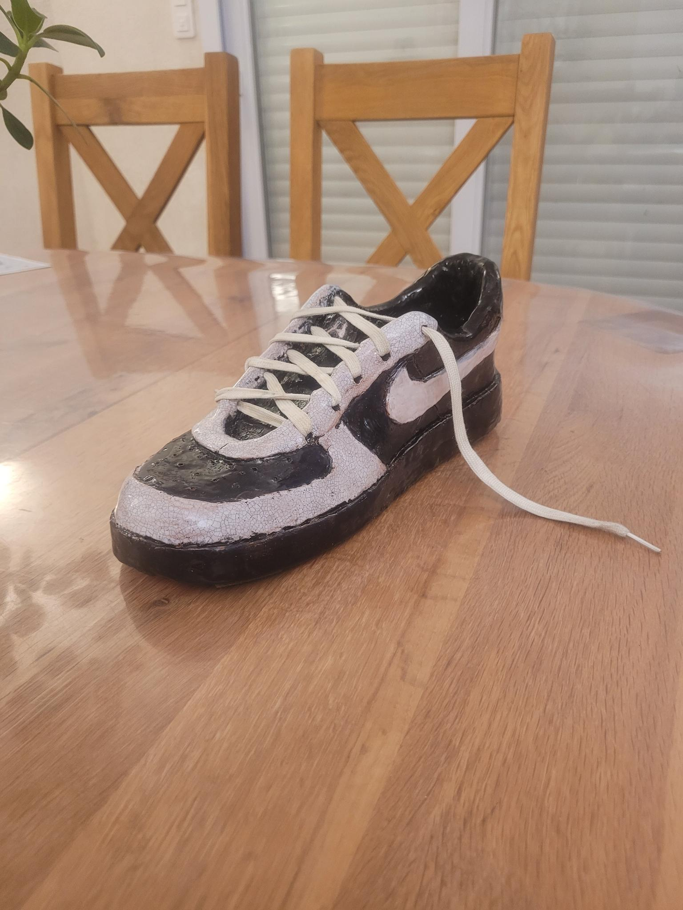

# BOOK Albin BOSSARD

## Qui suis-je ?
Je suis né en 2009 à rennes et passioné de dessin et création et voici donc mon book :
## Réalisations

### Tortue de mer

**Techniques** : croquis au crayon de papier puis repassage à la plume et application 
de gouache mélangé à du produit vaiselle pour créer des bulles que l'ont laisse éclater
pour créer les effets.

### Ferrari vintage

**Techniques** : croquis au crayon de papier puis gouache et stylo blanc.

Date de réalisation : 14 mars 2025

### Éléphant portant un bateau sur son dos

**Techniques** : Esquisse au crayon de papier puis repassage à la plume.

Date de réalisation : 2 décembre 2024

### Chaussure en poterie

**Techniques** : Réalisation de la base en terre rembourée avec du papier journal
puis détails avec des outils précis, perçage de trous pour les lacets et enfin peinture
puis cuisson à 1800 degrès !
Date de réalisation : 2023

## Projets collaboratifs

J'ai postulé pour rejoindre l'association FF musique et son projet de jeux.
Cela me permet de créer des objets 3D qui auront une utilité
TODO: METTRE IMAGE PORTE
https://www.jeveuxaider.gouv.fr/

## Stages en entreprise

**Stage chez Hiboost :**

Mon stage de 3ème a été réalisé chez l'entrepise Hiboost ( https://www.hiboost.fr/ )
J'ai pu voir le déroulement de 3 journées de projet de la création UI/UX au code et
passer du temps pour observer les différents métiers prèsents.
